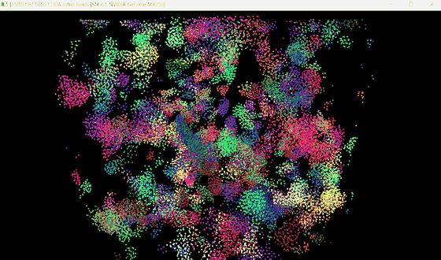
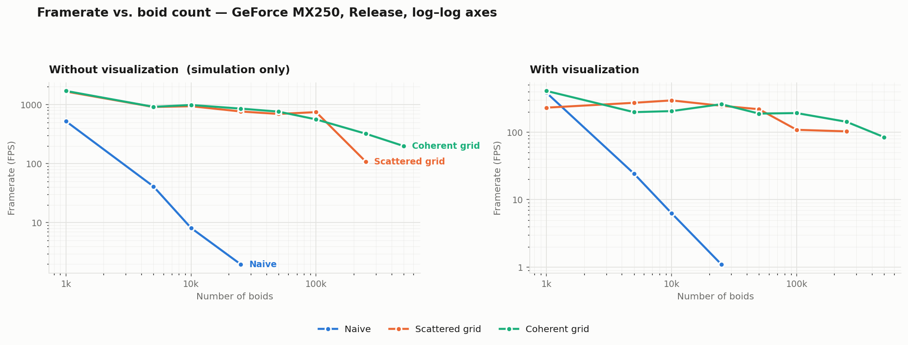
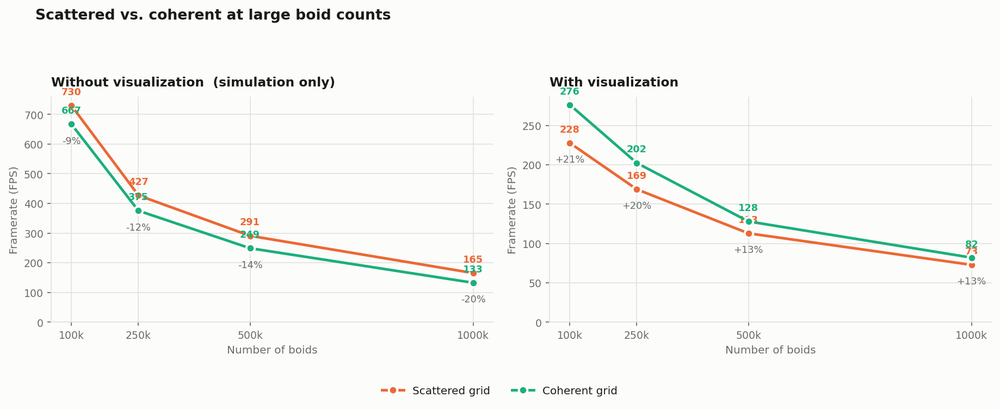
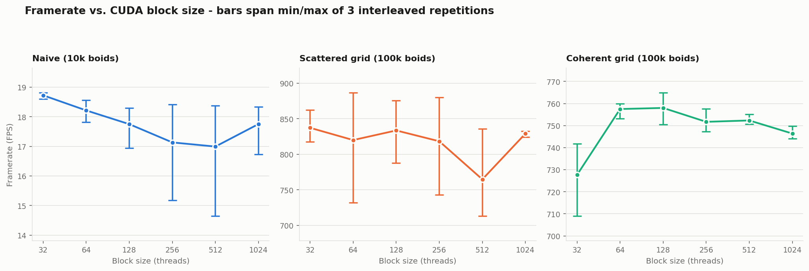
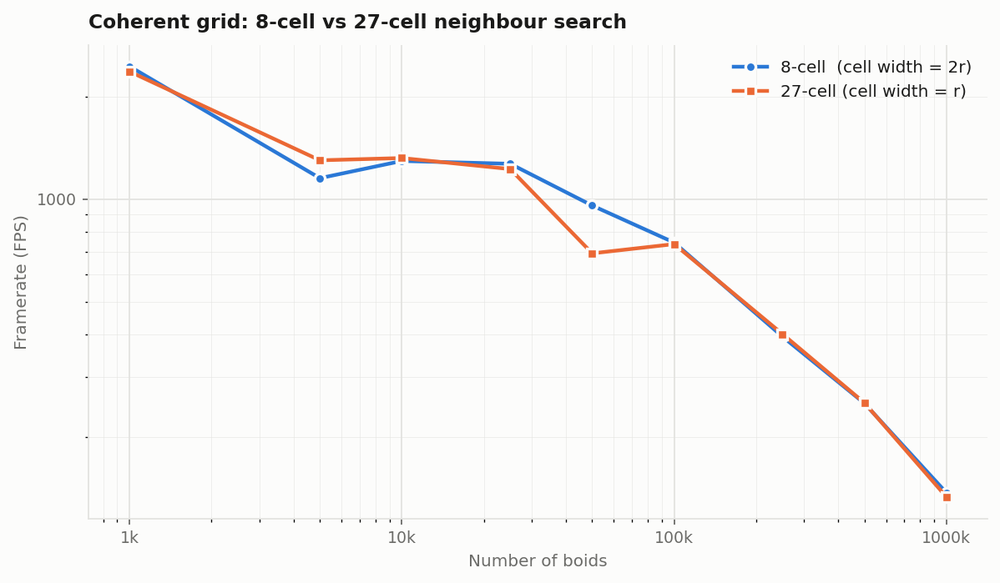
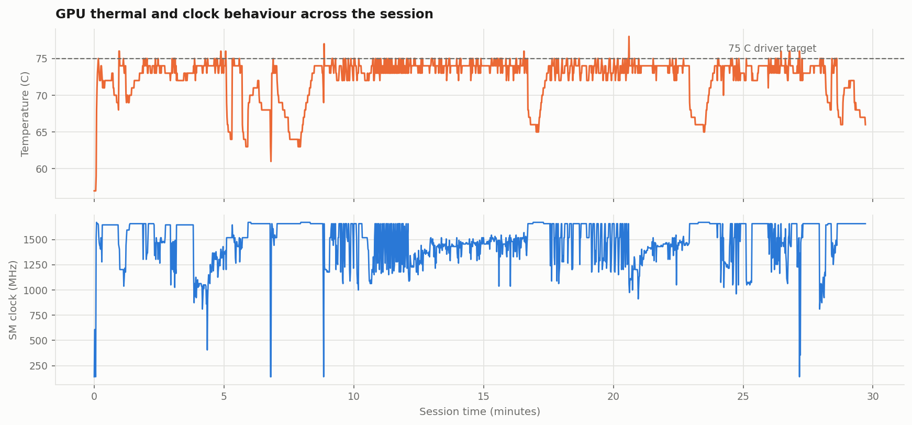

**University of Pennsylvania, CIS 5650: GPU Programming and Architecture,
Project 1 - Flocking**

* Neel Shejwalkar
  * [LinkedIn](https://www.linkedin.com/in/neel-shejwalkar/), [twitter](https://x.com/neelshej)
* Tested on: Windows 11, i7-10510U @ 1.80GHz 16GB, MX250 (GP108, sm_61) 2GB (Personal Computer)



| | |
|---|---|
| SMs | 3 |
| CUDA cores | 128/SM = 384 total |
| Max threads / SM | 2048 (64 warps) |
| Max blocks / SM | 32 |
| L2 cache | 512 KB |
| Shared memory | 96 KB/SM, 48 KB/block |
| Registers | 65,536 per SM |
| Memory bus | 64-bit @ 3004 MHz = 48.1 GB/s |
| VRAM | 2048 MB |
| SM clock (max) | 1582 MHz |
| Peak FP32 | 1215 GFLOP/s |

# Questions

### For each implementation, how does changing the number of boids affect performance? Why do you think this is?





For the naive approach, increasing the number of boids quadratically worsened the fps. It's clear to see why: to update the velocity in each step in the simulation, every single thread has to check the velocity and position of every other boid via dev_pos and dev_vel1, leading to around 2N^2 global memory accesses per step. Given that threads (within the same block) map to boids geometrically all over the simulation space, the GPU can't even take meaningful advantage of locality by caching reads to L1 for these arrays.

The scattered grid approach scaled far better. rather than making 2N reads to dev_pos and dev_vel1 per thread, each boid only needs to check (at most, given that I've implemented extra credit 1) the neighboring cells that land within a cube (of the size of largest rule distance) of the current boid. There are a couple of extra kernel invocations and a thrust::sort, but these add negligible latency compared to the gains from not checking every other boids' data.

The coherent grid approach scaled about just as well as the scattered grid approach, which was surprising to me (see my answer below). Conceptually, this approach has all of the same benefits as the scattered grid, with the added benefit of new buffers (dev_pos_sorted, dev_vel_sorted) that are populated prior to velocity and position updates. These new buffers allow for consecutive threads to access data that's also stored contiguously in global memory, because each thread in kernUpdateVelNeighborSearchCoherent indexes into the sorted position array. Consider a single warp, where all of the 32 boids are most likely in the same grid cell, and so would step through all of the neighboring grid cells and their boids together in lockstep. In this case, reads into the sorted velocity array would be mostly broadcast, leading to (theoretically) huge gains in performance.

### For each implementation, how does changing the block count and block size affect performance? Why do you think this is?



Each configuration run 6 times.

For every implementation, I tested a single (relatively large for the implementation) boid count at varying block sizes, and did not observe any meaningful differences between them. To confirm, I ran the test 6 times per block size, and found the variance to be somewhat negligible as well. At the very least, there isn't a clear trend.

Considering that we're not using any shared memory, we would only expect the performance to vary meaningfully if changing the blockSize leads to nearing some sort of limit (on registers, blocks/SM, threads/SM, etc) leading to a lack of active warps to effectively hide latency. Looking at my GPU's SM limits, we can see that a block size of 32 leads to 32 blocks being put on every SM, or 32 warps per SM, which is 32/64 = 50% occupancy. However, even this somewhat extreme configuration doesn't seem to yield any noticeable change in FPS compared to the others. This leads to the conclusion that the number of active warps/SM barely matters, and that latency hiding is not an issue on my machine.

NSight Systems doesn't support collecting GPU Metrics for my GPU's architecture (Pascal), and NSight Compute doesn't either, so I wasn't able to confirm this rigorously.

### For the coherent uniform grid: did you experience any performance improvements with the more coherent uniform grid? Was this the outcome you expected? Why or why not?


The results were very surprising. The coherent grid strategy was much better than the scattered grid strategy (21% better at 100k, 12.5% better at 1M) - but only when the visualization was enabled. With the visualization off, the trend is completely flipped. A perplexing result like this requires a deeper look into the work done by CUDA and OpenGL per frame.

Let's analyze both situations, starting with the visualization off. Coherent grid is somehow 25% slower than the scattered grid strategy. My first guess was that the added latency from reshuffling in kernReshuffleBoidData outweighed the gains of coalescing memory accesses. But looking at the nsys CUDA GPU Kernel Summary, I see that sorting + reshuffling is only 2% of the total time, whereas updating velocity is a staggering 97%. This can only mean the coherent grid has made the velocity updates slower for some reason. To investigate further, I'd need to use ncu which doesn't support my GPU.

```
 ** CUDA GPU Kernel Summary (cuda_gpu_kern_sum):

 Time (%)  Total Time (ns)  Instances   Avg (ns)     Med (ns)    Min (ns)   Max (ns)   StdDev (ns)   Name
 --------  ---------------  ---------  -----------  -----------  ---------  ---------  -----------   ----
     97.2      74778914941        300  249263049.8  249214485.5  173476422  423006581   32305568.2   kernUpdateVelNeighborSearchCoherent(int, int, glm::tvec3<float, (glm::precision)0>, float, float, i.
      1.3       1001705612       1200     834754.7     782929.0     467457    1424002     236740.2   void cub::CUB_200802_SM_610::DeviceRadixSortOnesweepKernel<cub::CUB_200802_SM_610::detail::radix::p.
      0.7        573714106        300    1912380.4    1901458.0    1495364   11053219     560970.6   kernReshuffleBoidData(int, int *, glm::tvec3<float, (glm::precision)0> *, glm::tvec3<float, (glm::p.
```

Now with the visualization on, timing runCUDA() and the OpenGL operations (glDrawElements, etc) for both implementations (100k boids) for one frame results in around 0.396ms vs 0.969ms for OpenGL related operations, for the coherent vs scattered grid strategy. For everything else (CUDA operations), it's around 3.38ms vs 3.42ms, which is basically identical. It's clear that the actual drawing pipeline (shaders, assembly, rasterization) takes far longer when the positions/velocities in the VBOs are scattered, whereas the actual CUDA operations barely benefit from the coherent grid.

### Did changing cell width and checking 27 vs 8 neighboring cells affect performance? Why or why not? Be careful: it is insufficient (and possibly incorrect) to say that 27-cell is slower simply because there are more cells to check!



There was no consistent effect here. They both resulted in very similar results except for an outlier at 50k boids. When searching 8 cells across a cell width of 2r (where r is the maximum of the radius of the three rules' distances), the volume searched is 8(2r)^3 = 64r^3, whereas searching 27 cells across a cell width of r results in 27r^3 volume searched. The 27 cells configuration searches fewer boids but has to make more grid accesses, and it seems as if the two cancel out on my GPU.

# Benchmark Methodology:
For the main test, for each of (with, without visualization), for each of (naive, scattered grid, coherent grid), I tested on a large range of boid numbers: 1k, 5k, 10k, 25k, 50k, 100k, 250k, 500k, 1M boids.

For each test, I set up a 3 second warmup period then measured the fps across the 5 seconds after the program began running.

Considering I was working on a budget laptop, benchmarking was a lot more complicated than I initially imagined. I had done most of my development on my friend's desktop workstation at first, which has a Blackwell with a ton of cooling, and imagined profiling would be a simple loop over the program.

For my GPU, thermal throttling begins at around 75 C. The laptop quickly shoots up to this temperature, then tweaks clock speeds to keep it here. In the case where the GPU still exceeds this temp, if it hits 97 C, thermal throttling occurs and aggressive clock cutting happens. Along with disabling V-Sync, I also positioned my laptop right next to the AC, had it plugged in, with all processes closed except for the ones I needed to run the program. This turned out to be extremely important. My initial benchmarks were on a hot laptop, sitting on my lap, with Chrome, VSCode and several other applications open, resulting in far lower clock speeds and worse performance by several orders of magnitude.




We can observe that the temperature and the clock speeds are roughly stable throughout the main benchmarking run.

To make it a bit more robust, I noted that the main goal was to compare different implementations at the same boid numbers, and then secondly to observe how the implementations themselves scaled with boid numbers. So some thermal drift across the second objective was fine, in service of the first objective. to make this work, I made sure all three implementations for a given boid size ran back to back to capture similar thermals, rather than, for example, having all of the naive runs go first, then scattered grid, etc. Although, given the stability of the clock speeds after implementing the fixes, this might not have made much of a difference.


### Problems:
- Blue Screen of Death
  - Solution: upgraded driver from 576.57 -> 581.80

